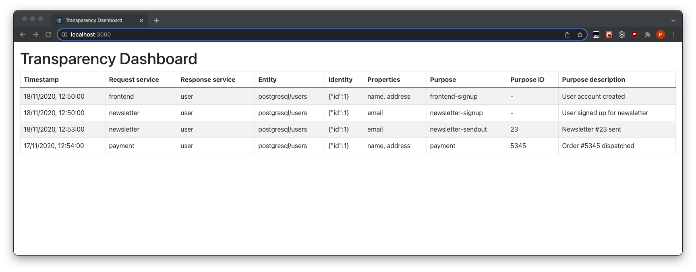

# Transparency Log

## Idea

The idea is to create a `Transparency Dashboard`, where a user can see all the inputs from our transparency library. We defined two data structures `trace` and `query` that allow us to save and fetch transparency records.

Trace:

```json
{
  "requestService": "service-1",
  "responseService": "service-2",
  "timestamp": "2020-11-18T11:50Z",
  "data": {
    "entity": "database/tablename",
    "identity": { "id": 1 },
    "properties": ["prop-x", "prop-y"]
  },
  "purpose": {
    "type": "purpose-type-x",
    "formatted": "Action x dispatched"
  }
}
```

Query:

```json
{
  "service": "service-name",
  "entity": "database/tablename",
  "identity": { "key": "value" }
}
```

The following table gives the general impression how the transparency data can be displayed:

Output:
Request Service | Response Service | Data | Purpose | Timestamp
----------------|------------------|----------------|---------------------|-----------------
service-1 | service-2 | prop-x, prop-y | Action x dispatched | 18.11.2021 11:53

## Actual implementation

The [frontend](frontend) directory contains a React frontend that renders [dummy transparency data](frontend/src/dummyData.ts). Go to the folder to find out more about runnning the webapp locally or building the static website.

